## Welcome!

### Setup

- Install [Tableau Public](https://public.tableau.com/en-us/s/)
- Download or clone the data in this repo.(shortcut:)
- Navigate to this repo(the one you're looking at) to follow along and save for later(shortcut:)!

### FAQ

- s
- s

What this workshop is

Intros

## What is Data Analytics

A method of collecting information and telling a story with it to help make decisions. 

### Common Analytic tools 

- Excel
- SQL
- Data Visualization tools (Tableau, PowerBI)

##### And sometimes:
- Python
- R

The Tools you use often depends on the company / clients you're working with.

## What is Tableau
about tool

great for visualizing data and creating interactive dashboards.

Usually used for its Drag and drop approach to making visualizing data easier.

### Data Visuliation Examples with Tableau

Lets take a further look at some of the things you can make with tableau!

Checkout [tableau public Gallery](https://public.tableau.com/en-us/s/gallery) for a bunch of awesome examples. This is also where your tableau files will get saved when you use Tableau Public. To save locally you need to purchase a lisence or have an education version.

- [Work usage in sacred texts](https://public.tableau.com/en-us/s/gallery/word-usage-sacred-texts?gallery=featured)
- [Dam.Nation](https://public.tableau.com/en-us/s/gallery/dam-nation-state-of-us-dams?gallery=featured)
- [G.O.A.T Music(turn volume down)](https://public.tableau.com/en-us/s/gallery/goat-music?gallery=featured)
- [Wealth Shares USA](https://public.tableau.com/en-us/s/gallery/wealth-inequality-us?gallery=featured)
- [Graffiti removal](https://public.tableau.com/en-us/s/gallery/graffiti-chicago?gallery=featured)
- [Malaria Deaths](https://public.tableau.com/en-us/s/gallery/malaria-africa?gallery=featured)

After the class make sure you explore more charts to get inspired, and see the full functionality of tableau!

Notice how not only are the visuals great, but there are a lot of opportunities to be interactive with the data! This is super useful to give to teams or clients who want to be able to explore more on there own easily. 

Tableau can be incredbly powerful! And can be a super useful tool to have in your toolset as a Data Analyst, Busniess Intellgence Analyst, or Data Scientist. 

Keep in mind that this is just an intro course and we will only be scratching the surface what tableau is capable of. If you find it interesting keep learning! 

We have a part time Data Analytics class! you'll cover data analytics with Excel, SQL, and Tableau. The course also includes our Career Services support to help find a job. 

# Lets make things with Tableau!

For the next hour or so we're going to be Data Analysts! 

We have three clients that want answers about their data. 

We're going to look at 4 different datasets, and answer questions about them.

Tip: For these workshop we will be using data thats already in a good formatted, but when working with clients in the feild be prepared to do a lot of data cleaning / reformattig!

### Project 1

The city of Seattle wants to know understand how many bikes are going accross the Fremont Brige. And what time of the year is most popular. Can possbly shed some insight on why?

This project we will be using the [Fremont Bridge Data](https://data.seattle.gov/Transportation/Fremont-Bridge-Hourly-Bicycle-Counts-by-Month-Octo/65db-xm6k)

You can view step by step instructions of what we did [here](fremont-step-by-step.md)

Find the Completed Project [here]().

### Project 2

Seattle loves its bike data! Lets pretend we own this bike company and we want to know what the trend is in riders. This should be a pretty fast analysis. Its similar to the last one. This will be the last bite related project tonight!

- Pronto Bikes Seattle

https://data.seattle.gov/Community/Pronto-Cycle-Share-Trip-Data/tw7j-dfaw

Find the Completed Project [here](pronto-step-by-step.md).

Find the Complete project [here](https://public.tableau.com/profile/sage.elliott#!/vizhome/ProntoBikes/Sheet1)

### Project 3

- Seattle Pet License

https://data.seattle.gov/Community/Seattle-Pet-Licenses/jguv-t9rb

Find the Completed Project [here](pet-step-by-step.md).

### Project 4

Titanic. 

Lets break away from Seattle data and look at the data from the titanic.

Find the Completed Project [here](titanic-step-by-step.md).

## Fremont Bridge

<!--You can view step by step instructions with pictures of what we're going to do [here](fremont-step-by-step.md).-->

Launch Tableau!

### Connect to Data Source (Fremont)

The type of file is a Comma Seperated Value(CSV) Format. To open this in tableau under connect click `Text file`

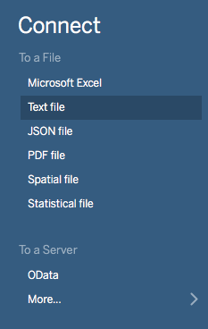

Navigate to where you saved the data file. And click open

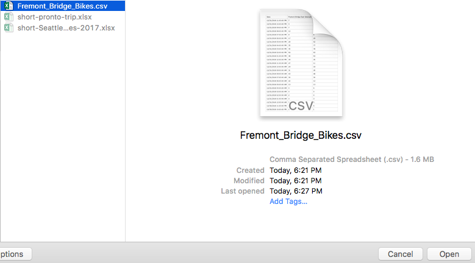

You should now see a screen similar to this:

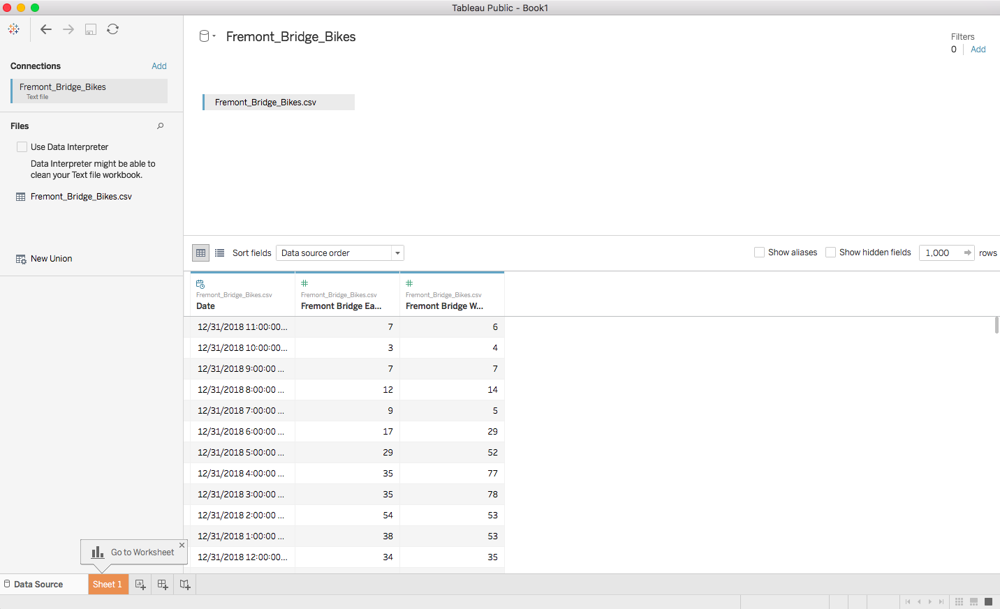

Notice the data in the bottom half of the screen that looks like an excel sheet. This is a good opportinuty to explore our data a bit before going further with the visualization.

We can see this dataset is failr simple. It only contains three columns. 

- The date and hour
- Number of bikes on East sidewalk
- Number of bikes on the west Sidewalk

After we're done looking at our data lets click on the `sheet 1` near the bottom left

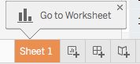

You should see a screen like this:

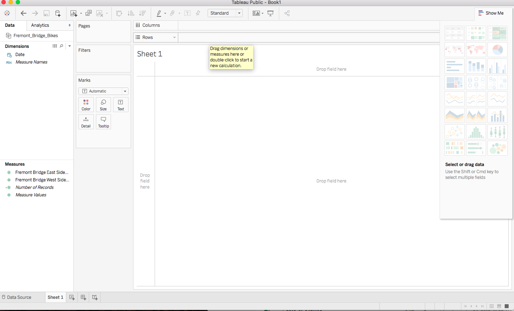

There are a lot of things going on here, lets may attention two parts right now:

- Columns and Rows

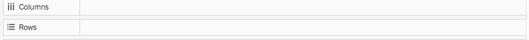

- Data
- - Dimension = Independant variable
- - Measure = Dependant variable

Measures can be grouped by Dimensions

Bike rides grouped by Month

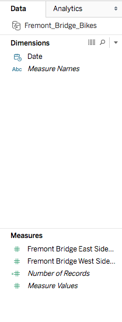

Since we know we want to visualize by month lets drag `Date` data into the columns section. If you've used excel to make charts before this probably makes sense, usually you can think of columns as going left to right. Rows usually are going from top to bottom.

Sheet Example:

Lets drag one of the sidewalk Measures into Rows

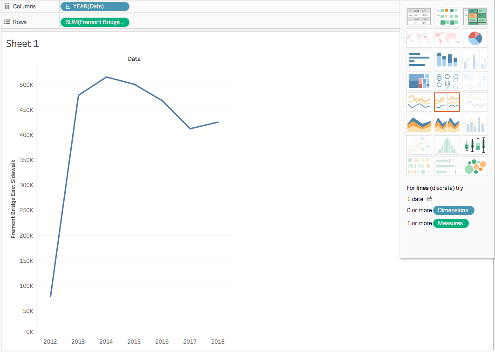

Change to month

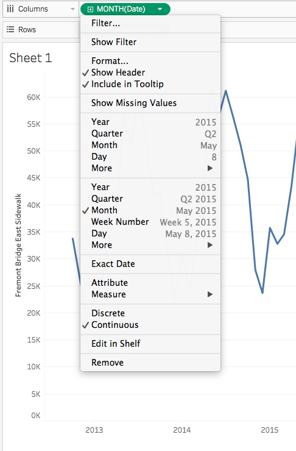

You may notice that our data in the columns section now turned green(measure) Why Month/Date changes to Measure

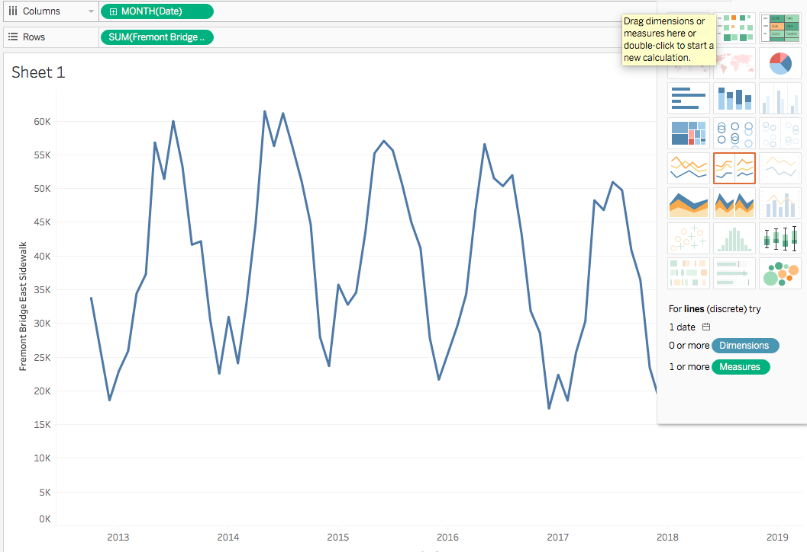

So from here we can actually already start seeing some insights about our data!

----

### Challenge: 
Even though we only have one of the sidewalks in our data we can start looking at some data:

What month has the lowest rides?
What month has the highest amount of rides?
Why do you think that is? Use you intuition!
Do you think the other sidewalk data will be the same?

----

Lets drag our other sidewalk data in the `rows` section.

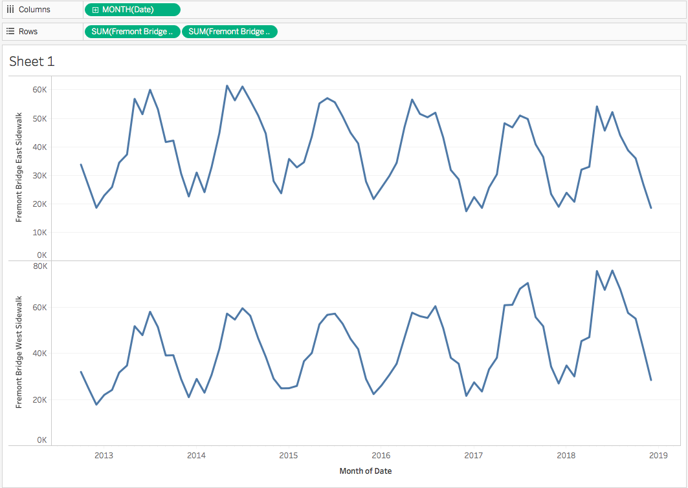

Neat! We can see that they're similar looking, but slightly different!

Now if we hover over our lines the toolip displays values from both sidewalks. Tableau is gussing we would want to compare them!

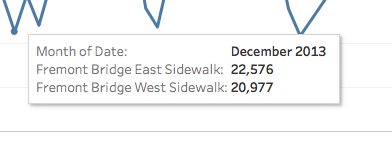

This is pretty cool! I think we can actually start getting a lot out of this!

Lets make play around with different ways to visulize this data:

Select side by side bar chart

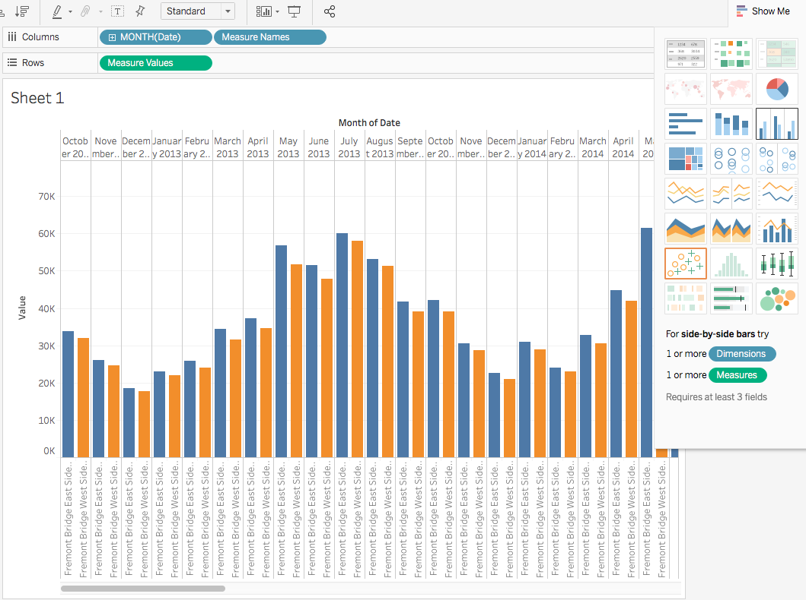

This actually isn't super terrible. We can see side by side how mnay rides there were for each month. 

But lets make this even cleaner!

Drag meausure names out of columns 

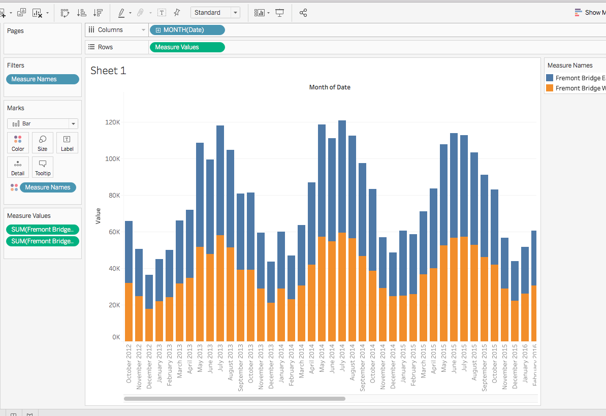

This gives a stacked chart. This actually may be useful if we want to see the combined amount of rides but still see what the split was like visually. 

It can still be a little hard to see how big the differenes are, lets make this a line chart. 

Instead of clicking show me to change the chart, this time we are going to click under the `Marks` section and select `line`

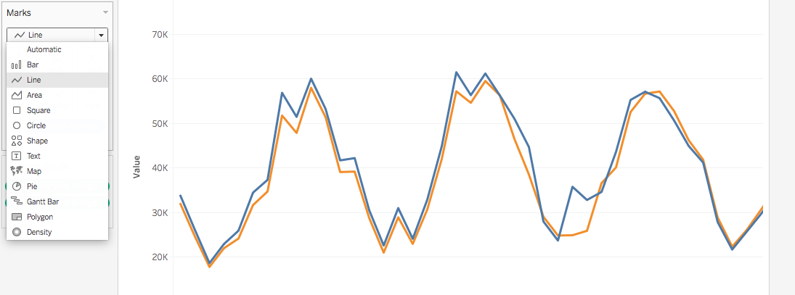

Now we can easily see the differences between each line (sidewalk).

Before we end this project lets poke around in tableau a little more!

Click on the `Analyitcs` tab right next to `Data`.

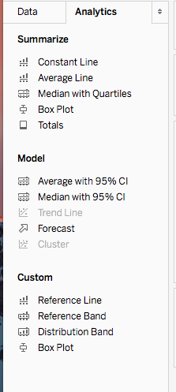

### Challenge
Click around on a few to explore different charts!
Are some better than others for answering different questions?

### Project Recap:
- import CSV files (what do we select)? 
- Measures vs dimensions (What are the differences?)
- How do we change chart types?

## Pronto Bikes Seattle

Seattle loves bike data! Lets use a lot of what we just learned in the previous section and do a quick analysis on this data!

In a time before LimeBikes and Jump there was once a bike company called [Pronto](https://en.wikipedia.org/wiki/Pronto_Cycle_Share) that inhabited Seattle. 

Our job as a Data Analyist is to figure out how many trips were take each month, and how to easily visulize those trips. What does the Trend of the number of rides per month look like?

### Importing Data (Pronto)

First we will need to import data. 

Select what type of data. In this case its Microsoft Excel(xls)

Navigate to where you saved the data and open the pronto-trp file

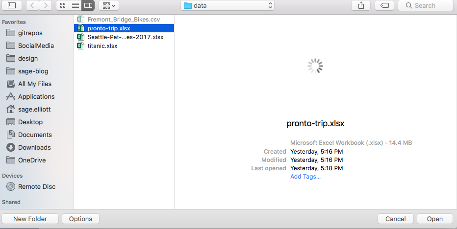

#### Explore your data (Pronto)

Know your data! Just like before, lets look at our data before going into visulizing our data.

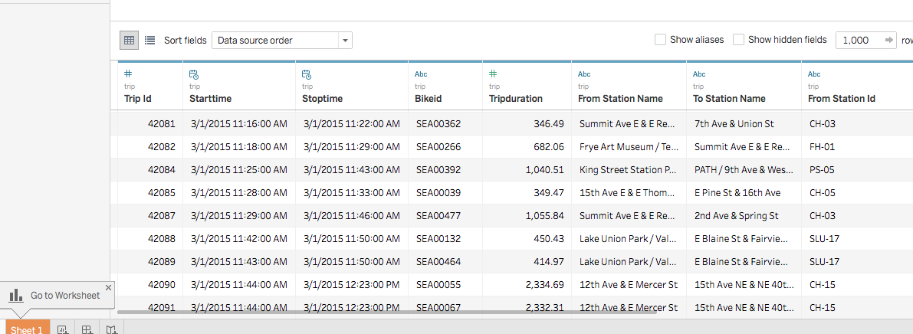

------
### Challenge: Get to know your data!

Using the method described above, take a look at your data.
Think about some things we could get insights on. What colunms do you find the most interesting?

------

Click on `sheet 1`

The work area should be similar to this:

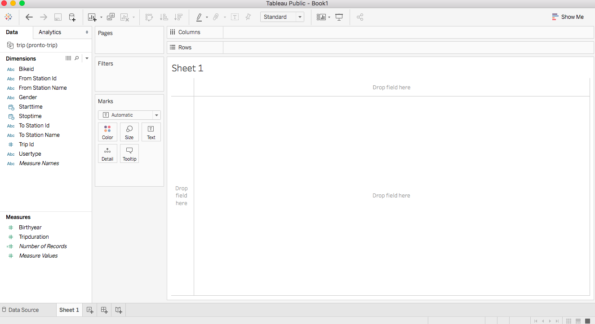

Lets drag in `nuumber of records`. Since each record is one ride we can use this number for total rides. 

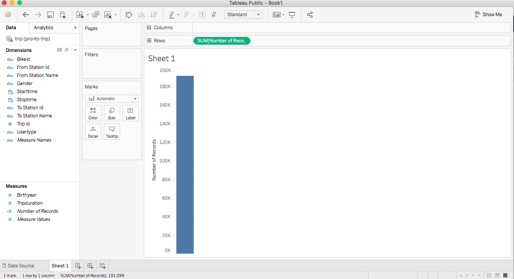

For our columns we could just throw in start time, but it looks a bit messy. Also for learning purposes lets make a new `calculated field`!

Calculated fields allow you to make a new piece of data by combining or pulling from your current data. You may want to multiply unit price by units sold. Add multiple measures together. Or in this case we just want to pull the month from a date.

Right click in your dimension area. 

Select `Create New Calculated Field...`

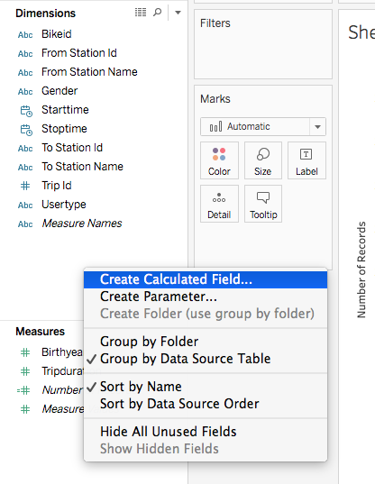

Lets call ours Month of Trip

And we will use the `DATENAME` function to pull the name of the month from our start time data. 

`DATENAME("month", [Starttime])`

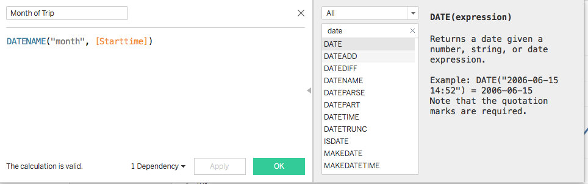

`Month of Trip` may end up in measures area. If so you can just drag it into dimensions.

Now lets drag `Month of trip` into the columns section. 

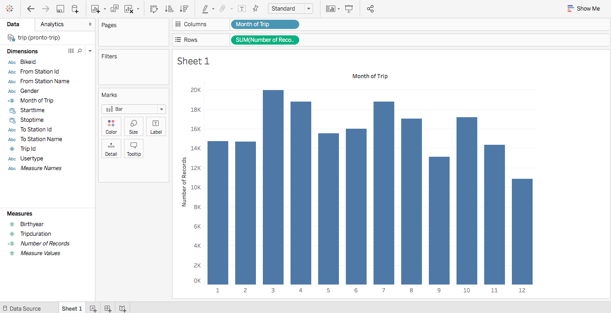

We can kind of see the tren from looking at the bar charts, but usually looking at a trend is better with a line

lets change that in our mark area. 

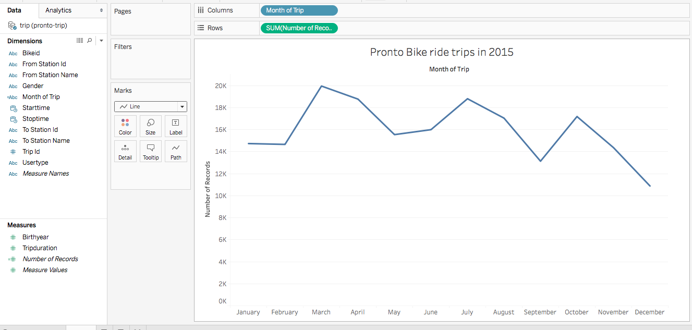

Cool! We can pretty clearly see the trend going down here!

### Project Recap:

- Calculated Fields (how do make them)?
- - What can we do with them?
- What do we slelect to import an excel sheet?

### Project Recap:

- What is a Dashboard?
- How can we add filters to sheets or dashboards

Thats a wrap on structured materail for tonight!

## Keep Learning!

[Data Science Prep](https://www.galvanize.com/data-science/prep)

## Upcoming Events!

We host so many events! check out our [calendar](https://www.galvanize.com/events)

Visit the [Learn to code Seattle](https://www.meetup.com/Learn-Code-Seattle/) meetup for all upcoming events.

## What is Galvanize?
###### We are a community!

#### Immersive Bootcamp

- [Data Science](https://www.galvanize.com/data-science) - 5/6/19 - 8/2/19 

- [Software Engineer](https://www.galvanize.com/web-development) - 2/19/19 - 5/17/19

#### Part-Time Courses

- [Data Analytics](https://www.galvanize.com/part-time/data-analytics) 2/12/19 - 5/2/19
- [Python Fundamentals](https://www.galvanize.com/part-time/data-science-fundamentals) - 2/20/19 - 3/29/19

#### Co-working Space

[work in our building!](https://www.galvanize.com/entrepreneur)

#### We are a community

## Questions

Please feel free to reach out to me with any questions! Let me know what you're planning to do next and how I can help!

- Website: [sageelliott.com](http://sageelliott.com/)
- Twitter: [@sagecodes](https://twitter.com/@sagecodes)
- LinkedIn: [sageelliott](https://www.linkedin.com/in/sageelliott/) 
- Email: [sage.elliott@galvanize.com](mailto:sage.elliott@galvanize.com)

